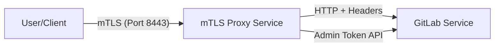
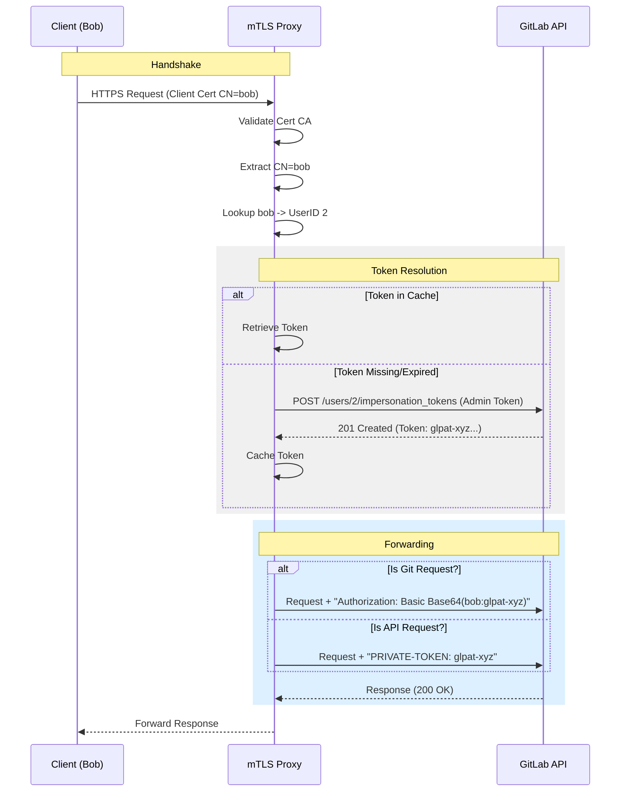

# GitLab mTLS Proxy Design Document

## 1. Overview
This document details the design and architecture of the GitLab mTLS Proxy, a secure sidecar/gateway service that enables mutual TLS (mTLS) authentication for a standard GitLab instance. The proxy handles client certificate verification and transparently upgrades requests to use GitLab Impersonation Tokens, allowing standard GitLab APIs and Git clients to function without awareness of the mTLS layer.

## 2. Architecture

The system consists of three main components running within a Kubernetes cluster:
1.  **Clients**: Users or automated systems possessing a valid X.509 Client Certificate.
2.  **mTLS Proxy**: A custom Go service that terminates mTLS, maps Common Names (CN) to GitLab User IDs, and manages authentication tokens.
3.  **GitLab**: Standard GitLab installation (Omnibus/Helm) listening on HTTP.

### 2.1 High-Level Deployment

## 3. Authentication Flow

The proxy implements a "Trusted Gateway" pattern where the proxy asserts identity to the backend.

### 3.1 Identity Mapping
*   **Source of Truth**: The Client Certificate's Subject **Common Name (CN)**.
*   **Mapping mechanism**: A static lookup table (or database) maps `CN -> GitLab User ID`.
*   **Authorization**: If the CN is not in the map, the connection is rejected (403/TLS Alert).

### 3.2 Token Exchange (Impersonation)
To communicate with GitLab, the proxy must authenticate *as* the user. It does this by dynamically generating **Impersonation Tokens** using a privileged GitLab Admin Token.

1.  **Request Reception**: Proxy receives request, validates Cert, extracts CN (e.g., `bob`).
2.  **User Lookup**: Proxy resolves `bob` to User ID `2`.
3.  **Token Check**: Proxy checks in-memory cache for a valid token for User ID `2`.
4.  **Token Generation (Cache Miss)**:
    *   Proxy makes a side-channel request to GitLab API: `POST /api/v4/users/2/impersonation_tokens`.
    *   Auth: Uses `GITLAB_ADMIN_TOKEN` environment variable.
    *   Scope: `api`.
    *   Expiry: Short-lived (e.g., 24 hours).
5.  **Token Storage**: New token is cached to reduce API load.

### 3.3 Request Forwarding
The proxy supports two modes of forwarding based on the request type:

#### A. Standard API Requests
For REST API calls, the proxy injects the `PRIVATE-TOKEN` header.

*   **Input**: `GET /api/v4/user`
*   **Transformation**: Inject `PRIVATE-TOKEN: <impersonation_token>`
*   **Upstream**: `http://gitlab/api/v4/user`

#### B. Git-over-HTTPS Requests
Git clients use Basic Authentication. The proxy synthesizes these credentials.

*   **Input**: `GET /root/repo.git/info/refs`
*   **Transformation**:
    *   Construct `username`: mapped username (e.g., `bob`).
    *   Construct `password`: the impersonation token.
    *   Encode: `Base64(username:token)`.
    *   Inject: `Authorization: Basic <base64_string>`.
*   **Upstream**: `http://gitlab/root/repo.git/info/refs`

## 4. Sequence Diagram

## 5. Deployment Configuration

*   **Runtime**: Kubernetes / Kind.
*   **Image**: `localhost/gitlab-proxy:latest`.
*   **Environment Variables**:
    *   `UPSTREAM_URL`: Internal URL of GitLab service.
    *   `GITLAB_ADMIN_TOKEN`: Privileged token for impersonation creation.
*   **Volumes**:
    *   `/certs/server.crt`, `/certs/server.key`: Proxy identity.
    *   `/certs/ca.crt`: Client trust root.

## 6. Limitations
*   No robust readiness probes for upstream dependency (basic TCP dial).
*   User Map is currently hardcoded in `main.go` source (requires rebuild to add users).
*   No support for CRL/OCSP revocation lists (revocation requires removing CA or code update).
*   **Token Lifespan Limitation**: GitLab API `expires_at` field only accepts `YYYY-MM-DD` format. This enforces a minimum token validity of ~24 hours. Tokens evicted from the proxy cache may still be valid in GitLab until the end of the day.

## 7. Scalability & Performance
The proxy architecture relies on ephemeral token generation. High traffic volume can lead to rapid token churn.

### 7.1 Database & Storage Impact
*   **Token Volume**: Issuing 10,000+ tokens/day generates ~3.6M rows/year in the `personal_access_tokens` table.
*   **Impact**:
    *   **Postgres Write Load**: Negligible (~0.2 TPS for 10k/day).
    *   **Table Bloat**: Requires efficient background workers (Sidekiq) to purge expired tokens. If cleanup lags, table growth can impact query performance for auth checks.
    *   **Audit Logs**: High volume of "Token Created" events will flood audit logs.

### 7.2 CPU Impact
*   **Hashing**: Token generation involves `bcrypt`/`argon2` hashing, which is CPU intensive. A "Login Storm" (e.g., 500 users connecting simultaneously constantly) could saturate the GitLab Rails CPU if cache TTL is too short.

### 7.3 Recommendation
*   Tune Proxy Cache TTL to balance Security vs Performance (Current: 60m).
*   Ensure GitLab background workers are healthy to handle token expiration/cleanup.
